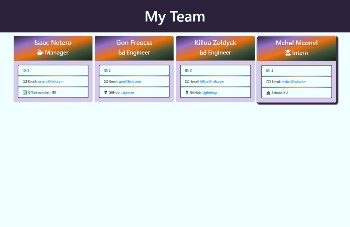

# [10-employee-summary](https://github.com/MichelleMcConville/10-employee-summary) 🔗


## Description

A simple Node CLI for generating a software engineering team roster based on user input

## Preview

| ***Demo***                         | ***Screenshot***                      |
| :--------------------------------: | :-----------------------------------: |
|  |   |

## Table of Contents ✨

1. [Installation](#installation)
2. [Usage](#usage)
3. [contributing](#contributing)
4. [Tests](#tests)
5. [Questions](#questions)
6. [License](#license)

## Installation 🛠️ <a name="installation"></a>

```node
Type the following npm install commands one at a time:
npm install -y, npm i inquirer
```

## Usage ⚙️ <a name="usage"></a>

```node
Type the following command to run program:
node app.js
```

## Contributing 🤝 <a name="contributing"></a>

All contributions must be approved by owner

## Test ✅ <a name="tests"></a>

npm run test

## Questions ❓ <a name="questions"></a>

* 📧 If you have any questions please [**eMail**](mailto:dev.mchel@gmail.com) me
* :octocat: Check out more of my work on [**GitHub**](https://github.com/MichelleMcConville)

## Licence 📝 <a name="license"></a>

This project is **`Internet Systems Consortium`** licensed

---

 Copyright ©️ 2020 🌷 Michelle McConville
